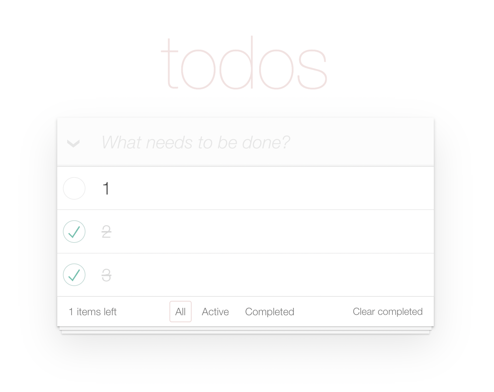

#  Welcome to the React TODO APP repository!

- [DEMO LINK](https://chrishryts.github.io/todo-app/)

  

This project implements a Todo application based on React that saves all changes to the API.

The app features an efficient, user-friendly interface designed to simplify daily task tracking. It enables users to manage their tasks successfully by providing options such as adding, deleting, toggling task status, and renaming tasks. Additionally, the app includes error handling to ensure a smooth user experience. The use of TypeScript enhances the development process by providing type safety and improved code readability.

## Technologies

- **React**: A JavaScript library for building user interfaces.
- **TypeScript**: An extension of JavaScript with support for strict typing.
- **CSS**: A styling language for designing web pages.
- **Fetch**: An API for making network requests in the browser.

## Real-Time Updates

The app communicates with an API to ensure your data is always up-to-date. When you toggle a todo's status or rename it, the changes are immediately reflected, giving you a smooth and responsive experience.

## Features:

- **User Authentication**. The app verifies a valid user ID before showing the current task list.
- **Loading todos** (via POST request to the API). 
- **Create Tasks**. Users have the ability to add new tasks to their todo list.
- **Remove Tasks**. Users can remove tasks from their list individually or in bulk.
- **Update Status**. Users can mark tasks as done or not done.
- **Edit Tasks**. Users can change the names of existing tasks.
- **Error Management**. The app shows relevant error messages if issues arise. The input value is cleared on success and preserved and focused on error. The notification is automatically hidden after 3 seconds and before any next request.
- Elements are hidden or disabled if they can't be used at the moment.
- The text field is focused so the user can start typing without extra clicks.
- Users are prevented from performing the same action twice accidentally (controls are disabled when an action is in progress).
- **Loader Overlays**. Spinners are shown on todos immediately to notify the user that an action is in progress.
- Todos are filtered by status: All / Active / Completed.
- The input is disabled until a response is received from the API.
- Immediately after sending a request, a todo with id: 0 is created and saved to the tempTodo variable in the state.
- The text is cleared in case of success and kept in case of error.
- **Context**. State handling is optimized through context-based data storage, ensuring efficient management and high performance of the application.

Your input is welcome! If you discover any bugs or have ideas for improvements, feel free to send email here khrystyna.hryts@outlook.com or submit a pull request.
